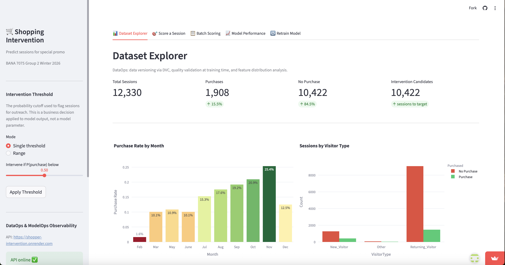

# 🛒 Online Shopper Intervention System


An end-to-end machine learning project that predicts which e-commerce sessions are unlikely to convert, enabling targeted promotional interventions in real time.

## Live Demo
- **Dashboard:** [shopintervene.streamlit.app](https://shopintervene.streamlit.app)
- **API Docs:** [shopper-intervention.onrender.com/docs](https://shopper-intervention.onrender.com/docs)
- **MLflow Experiments:** [dagshub.com/smbrownai/shopper_intervention](https://dagshub.com/smbrownai/shopper_intervention.mlflow)

---

## Dashboard Preview

---

## Table of Contents

- [About](#about)
- [Dashboard Walkthrough](#dashboard-walkthrough)
- [System Architecture](#system-architecture)
- [Modeling Approach](#modeling-approach)
- [Tech Stack](#tech-stack)
- [How to Run](#how-to-run)
- [Documentation](#documentation)
- [Dataset](#dataset)
- [Contributing](#contributing)
- [Authors](#authors)
- [License](#license)

---
## About

### Business Problem
Co-Mart, a fictional online clothing retailer, spends heavily to bring visitors to its website, yet only **15.5% of sessions lead to a purchase**. In the dataset used for this project, that corresponds to **1,908 purchases out of 12,330 sessions**.

To increase conversions, Co-Mart is considering a **15% discount offer**. The challenge is that offering discounts to every visitor would reduce margins and generate too many wasted incentives.

This project uses machine learning to identify sessions that are likely to end without a purchase and are better candidates for targeted intervention.

### Solution Overview

The system predicts **purchase probability** for each session and applies a configurable business threshold to flag sessions for intervention. Predictions are surfaced through:

- an interactive **Streamlit dashboard**
- a **FastAPI inference service**
- tracked experiments in **MLflow**
- data versioning via **DVC**

### Key Capabilities

- Real-time scoring for individual sessions
- Batch scoring for operational targeting
- Configurable intervention threshold
- Champion/challenger model comparison
- Experiment tracking with MLflow
- Retraining workflow from the UI
- Data versioning and validation with DVC

---

## Dashboard Walkthrough

| Tab | Description |
|---|---|
| 📊 Dataset Explorer | EDA charts — purchase rates, visitor types, page values, bounce/exit rates |
| 🎯 Score a Session | Manual feature entry → live prediction → intervention decision + gauge chart |
| 📋 Batch Scoring | Upload CSV → batch predictions → 5 analysis charts + downloadable results |
| 📈 Model Performance | Champion and challenger metrics, intervention logic explanation |
| 🔁 Retrain Model | Hyperparameter overrides, preprocessing options, kick off training from UI |

---

## System Architecture

```
data/
  online_shoppers_intention.csv   — UCI dataset (12,330 sessions)

scripts/
  features.py                     — Shared preprocessing pipeline (train + inference)
  train.py                        — MLflow training: LR, DT, RF, XGBoost

api/
  main.py                         — FastAPI inference server

ui/
  app.py                          — Streamlit dashboard

models/
  best_model_meta.json            — Champion/challenger metadata (synced with MLflow Registry)
```

---
### End-to-End Workflow

1. Raw session data is versioned and validated
2. Features are preprocessed using a shared training/inference pipeline
3. Multiple models are trained and evaluated
4. The best model is promoted to **champion**
5. Predictions are served through the API and dashboard
6. A configurable threshold determines intervention candidates
7. Retraining can be triggered when updated data or settings are available

---

## Modeling Approach

### Models

Four classifiers are trained and compared on every run:

| Model | Notes |
|---|---|
| Logistic Regression | Baseline model with balanced class weights |
| Decision Tree | Interpretable model with configurable depth and criterion |
| Random Forest | Ensemble method with balanced class weights |
| XGBoost | Gradient boosting model with `scale_pos_weight` |

The best model by **ROC-AUC** is promoted to **champion** and registered in the MLflow Model Registry. The second-best model becomes the **challenger**. Both are available for comparison in the dashboard and API workflow.

### Preprocessing Pipeline

Defined in `scripts/features.py` and shared between training and inference:

- **Numeric features** are imputed using median or mean, then standardized
- **Categorical features** are imputed using mode, then one-hot encoded
- **Feature groups** can be selectively excluded during training for comparison experiments
- **No data leakage** is introduced because preprocessing is fit only on training data and reused consistently at inference time

### Intervention Logic

The model outputs **P(purchase)** for each session.

Sessions below a configurable threshold are flagged for intervention, such as a coupon or free shipping offer. The default threshold is **30%**, but it can be changed through the application.

This threshold is a **business rule applied to model output**, not a model parameter.

---

## Tech Stack

- **Python**
- **scikit-learn**
- **XGBoost**
- **FastAPI**
- **Streamlit**
- **MLflow**
- **DVC**
- **DagsHub**
- **Render**
- **Streamlit Community Cloud**

---

## How to Run

### 1. Install dependencies
```bash
pip install -r requirements.txt
```

### 2. Set environment variables
```bash
export DAGSHUB_TOKEN=your_token_here
export MLFLOW_TRACKING_URI=https://dagshub.com/smbrownai/shopper_intervention.mlflow
```

### 3. Train models
```bash
python scripts/train.py
# Logs all runs to MLflow, registers champion and challenger in MLflow Registry,
# writes models/best_model_meta.json
```

### 4. Start FastAPI server
```bash
uvicorn api.main:app --reload --port 8000
# Docs: http://localhost:8000/docs
```

### 5. Launch Streamlit dashboard
```bash
streamlit run ui/app.py
```

---

## Documentation

### API Endpoints

| Method | Endpoint | Description |
|---|---|---|
| GET | `/` | Health check and current model info |
| GET | `/model-info` | Champion/challenger metadata |
| POST | `/predict` | Score a single session |
| POST | `/predict-batch` | Score up to 25,000 sessions |
| GET / POST | `/threshold` | Get or update intervention threshold |
| POST | `/retrain` | Trigger a training run |
| GET | `/retrain-status` | Poll training progress |

### Application Features

- Interactive dashboard for business and technical users
- Live scoring and intervention recommendation
- Batch scoring for operational use cases
- Model comparison and performance monitoring
- Retraining workflow with updated settings

---

## Dataset

**Source:** UCI Machine Learning Repository  
**Dataset:** [Online Shoppers Purchasing Intention Dataset](https://archive.ics.uci.edu/ml/datasets/Online+Shoppers+Purchasing+Intention+Dataset)

- **12,330 sessions**
- **18 input features**
- **Binary classification target**

### Target Variable

- `Revenue = True` → session resulted in a purchase
- `Revenue = False` → session did not purchase and may be considered for targeted intervention

The dataset is imbalanced, with approximately:

- **84% no purchase**
- **16% purchase**

Because of this imbalance, models are evaluated primarily using **ROC-AUC** rather than accuracy.

---

## Contributing

This repository was developed as a course project. Suggestions, improvements, and feedback are welcome through issues or pull requests.

---

## Authors

**Group 2**

- Oladele Awonusi
- Shawn Brown
- Judith Geraci
- Kristin Jones
- Hoda Nassar

---

## License

This project is provided for academic and portfolio purposes.
